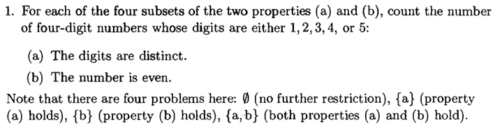
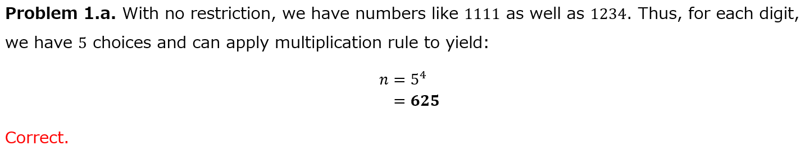
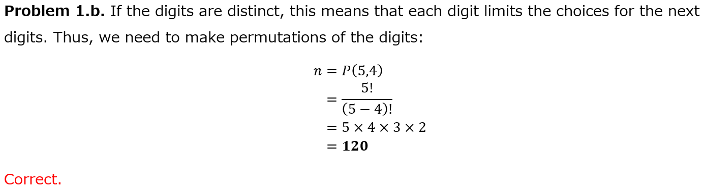
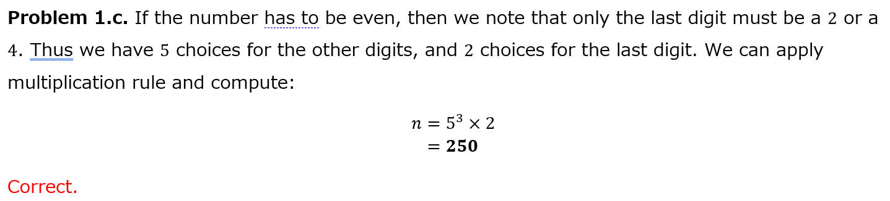
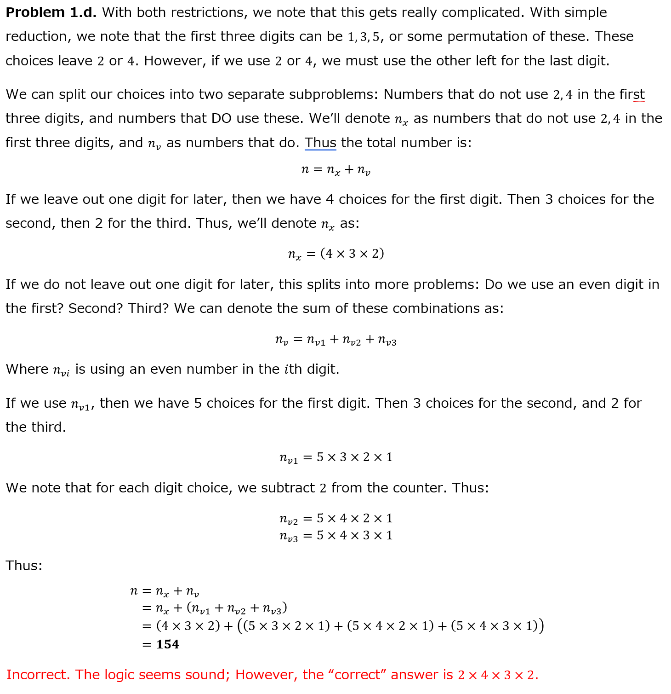

# Combinations of 12345

This is a small sub-project to prove to myself the answer of a specific problem
in my Elementary Combinatorics class.

# The Problem



The answers to this problem are:









I had to verify that the answers were indeed correct. So, I made a series of
Python scripts testing them.

# The solution

Basically, I can compute all possible 4-combinations of the set {1, 2, 3, 4, 5}.
This will be my universal set.

By subtracting all combinations that do not match, I can get the answers through
brute force.

# Results

Problems 1a, 1b, 1c, and 1d were all proven true through brute force.

```
Problem 1.a: 625
Problem 1.b: 120
Problem 1.c: 250
Problem 1.d: 48
```

Thus, my solution method was incorrect.

# License TL;DR

This project is distributed under the MIT license. This is a paraphrasing of a
[short summary](https://tldrlegal.com/license/mit-license).

This license is a short, permissive software license. Basically, you can do
whatever you want with this software, as long as you include the original
copyright and license notice in any copy of this software/source.

## What you CAN do:

-   You may commercially use this project in any way, and profit off it or the
    code included in any way;
-   You may modify or make changes to this project in any way;
-   You may distribute this project, the compiled code, or its source in any
    way;
-   You may incorporate this work into something that has a more restrictive
    license in any way;
-   And you may use the work for private use.

## What you CANNOT do:

-   You may not hold me (the author) liable for anything that happens to this
    code as well as anything that this code accomplishes. The work is provided
    as-is.

## What you MUST do:

-   You must include the copyright notice in all copies or substantial uses of
    the work;
-   You must include the license notice in all copies or substantial uses of the
    work.

If you're feeling generous, give credit to me somewhere in your projects.
